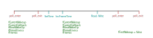

# Timers

## Kernel documentation

- [ALSA Kernel Documentation](https://docs.kernel.org/sound/designs/timestamping.html)

Various times measured by ALSA:

```
--------------------------------------------------------------> time
  ^               ^              ^                ^           ^
  |               |              |                |           |
 analog         link            dma              app       FullBuffer
 time           time           time              time        time
  |               |              |                |           |
  |< codec delay >|<--hw delay-->|<queued samples>|<---avail->|
  |<----------------- delay---------------------->|           |
                                 |<----ring buffer length---->|
```

## Timing options

All the various choices available:

```c
/** PCM timestamp type */
typedef enum _snd_pcm_tstamp_type {
    SND_PCM_TSTAMP_TYPE_GETTIMEOFDAY = 0, /**< gettimeofday equivalent */
    SND_PCM_TSTAMP_TYPE_MONOTONIC,        /**< posix_clock_monotonic equivalent */
    SND_PCM_TSTAMP_TYPE_MONOTONIC_RAW,    /**< monotonic_raw (no NTP) */
    SND_PCM_TSTAMP_TYPE_LAST = SND_PCM_TSTAMP_TYPE_MONOTONIC_RAW,
} snd_pcm_tstamp_type_t;

/** PCM audio timestamp type */
typedef enum _snd_pcm_audio_tstamp_type {
    /**
     * first definition for backwards compatibility only,
     * maps to wallclock/link time for HDAudio playback and DEFAULT/DMA time for everything else
     */
    SND_PCM_AUDIO_TSTAMP_TYPE_COMPAT = 0,
    SND_PCM_AUDIO_TSTAMP_TYPE_DEFAULT = 1,           /**< DMA time, reported as per hw_ptr */
    SND_PCM_AUDIO_TSTAMP_TYPE_LINK = 2,              /**< link time reported by sample or wallclock counter, reset on startup */
    SND_PCM_AUDIO_TSTAMP_TYPE_LINK_ABSOLUTE = 3,     /**< link time reported by sample or wallclock counter, not reset on startup */
    SND_PCM_AUDIO_TSTAMP_TYPE_LINK_ESTIMATED = 4,    /**< link time estimated indirectly */
    SND_PCM_AUDIO_TSTAMP_TYPE_LINK_SYNCHRONIZED = 5, /**< link time synchronized with system time */
    SND_PCM_AUDIO_TSTAMP_TYPE_LAST = SND_PCM_AUDIO_TSTAMP_TYPE_LINK_SYNCHRONIZED
} snd_pcm_audio_tstamp_type_t;

/** PCM audio timestamp config */
typedef struct _snd_pcm_audio_tstamp_config {
    /* 5 of max 16 bits used */
    unsigned int type_requested:4; /**< requested audio tstamp type   */
    unsigned int report_delay:1;   /**< add total delay to A/D or D/A */
} snd_pcm_audio_tstamp_config_t;

/** PCM audio timestamp report */
typedef struct _snd_pcm_audio_tstamp_report {
    /* 6 of max 16 bits used for bit-fields */

    unsigned int valid:1;       /**< for backwards compatibility */
    unsigned int actual_type:4; /**< actual type if hardware could not support requested timestamp */

    unsigned int accuracy_report:1; /**< 0 if accuracy unknown, 1 if accuracy field is valid */
    unsigned int accuracy;          /**< up to 4.29s in ns units, will be packed in separate field  */
} snd_pcm_audio_tstamp_report_t;
```

## Jack timekeeping

- [Using a DLL to filter time](https://kokkinizita.linuxaudio.org/papers/usingdll.pdf)
- Atomic struct
  - read by: audio driver - `JackAlsaDriver::frame_time()`
  - read by: midi driver - `jack_frame_time` -> `JackAlsaDriver::frame_time()`
  - aux write (poll_exit): audio driver - `JackAlsaDriver::SetTime(..)`
  - written by: jack engine control - `JackEngineControl::CycleIncTime()`
- Keeps track of `fFirstWakeUp`, i.e. whether xrun was encountered / device was started/reset

```cpp
// 1. fBeginDateUst has been set in alsa_driver_wait;
            SetTime(time = poll_ret);
                fBeginDateUst = time;

// 2. CycleIncTime has to be done before read
JackDriver::CycleIncTime();
    fEngineControl->CycleIncTime(fBeginDateUst);
        fFrameTimer.IncFrameTime(fBufferSize, callback_usecs = fBeginDateUst, fPeriodUsecs);
            if (fFirstWakeUp) {
                InitFrameTimeAux(callback_usecs = fBeginDateUst, period_usecs = fPeriodUsecs);
                fFirstWakeUp = false;
            }
            IncFrameTimeAux(buffer_size = fBufferSize, callback_usecs = fBeginDateUst, period_usecs = fPeriodUsecs);
                float delta = (float)((int64_t)callback_usecs - (int64_t)timer->fNextWakeUp);
                delta *= timer->fFilterOmega;
                timer->fCurrentWakeup = timer->fNextWakeUp;
                timer->fCurrentCallback = callback_usecs;
                timer->fFrames += buffer_size;
                timer->fPeriodUsecs += timer->fFilterOmega * delta;
                timer->fNextWakeUp += (int64_t)floorf(timer->fPeriodUsecs + 1.41f * delta + 0.5f);
```



---
